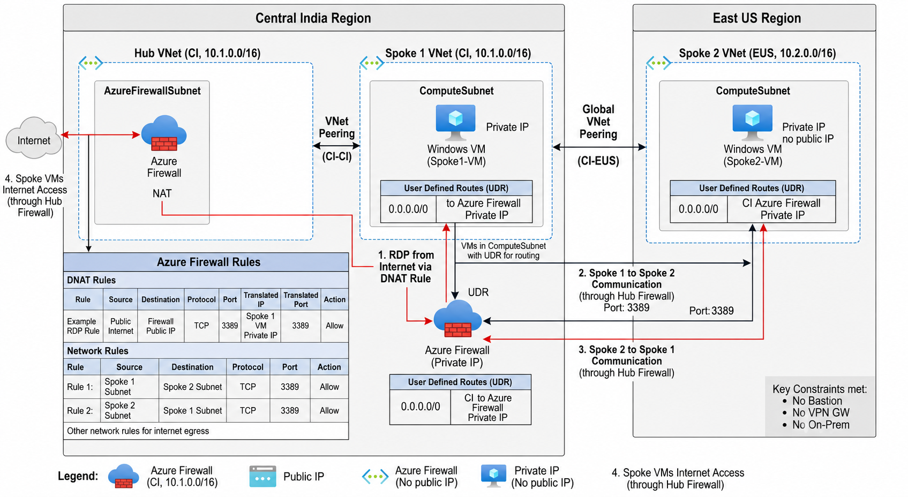
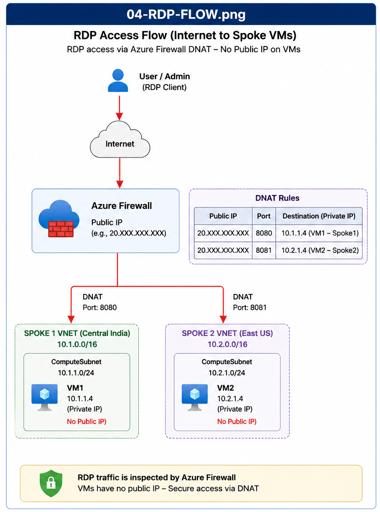

# Azure Hub-and-Spoke Network Architecture with Azure Firewall

A secure Azure Hub-and-Spoke network architecture demonstrating centralized security using Azure Firewall, Global VNet Peering, User Defined Routes (UDR), and DNAT Rules.

---

# Project Overview

This project demonstrates how to securely connect multiple Azure VNets using a Hub-and-Spoke architecture.

The solution uses Azure Firewall as the central security device to inspect traffic between VNets and securely publish RDP access without assigning Public IP addresses to virtual machines.

Project Highlights

- Hub VNet in Central India
- Spoke 1 VNet in Central India
- Spoke 2 VNet in East US
- Azure Firewall in Hub
- Global VNet Peering
- User Defined Routes (UDR)
- DNAT for Remote Desktop
- Windows Server Virtual Machines
- No Public IP on Virtual Machines

---

# Architecture


---

# Network Traffic & RDP Flow


---
# RDP Flow



---

# Azure Services Used

- Azure Virtual Network
- Azure Firewall
- Azure Firewall Policy
- Azure Route Table (UDR)
- Azure Network Security Groups
- Azure Public IP
- Azure Virtual Machines
- Azure VNet Peering
- Windows Server 2025

---

# Network Design

Hub VNet

Region

Central India

Address Space

10.0.0.0/16

Contains

Azure Firewall

---

Spoke 1

Region

Central India

Address Space

10.1.0.0/16

VM Private IP

10.1.1.4

---

Spoke 2

Region

East US

Address Space

10.2.0.0/16

VM Private IP

10.2.1.4

---

# Traffic Flow

Internet

↓

Azure Firewall Public IP

↓

DNAT Rule

↓

Windows VM

For Spoke-to-Spoke Communication

VM1

↓

UDR

↓

Azure Firewall

↓

VNet Peering

↓

Azure Firewall

↓

VM2

---

# Azure Firewall Rules

## DNAT Rules

| Public Port | Destination VM | Private Port |
|-------------|----------------|--------------|
|8080|VM1|3389|
|8081|VM2|3389|

---

## Network Rules

Allow

Spoke1

↓

Spoke2

TCP

3389

Allow

Spoke2

↓

Spoke1

TCP

3389

---

# Folder Structure

```

Azure-Hub-Spoke-Azure-Firewall/

│

├── README.md

├── LICENSE

│

├── 01-Architecture/

│ ├── 01-Final-Architecture.png

│ └── 02-Network-Traffic-Flow.png
│ └── 03-RDP-Flow.png
│

├── 02-Screenshots/

│

├── 03-Documentation/

│

└── 04-Scripts/

```

---

# Deployment Steps

1. Create Resource Group
2. Create Hub VNet
3. Deploy Azure Firewall
4. Create Spoke 1
5. Create Spoke 2
6. Configure Global VNet Peering
7. Create Route Tables
8. Associate UDR
9. Configure Azure Firewall Network Rules
10. Configure DNAT Rules
11. Verify VM Communication

---

# Testing

Successfully Tested

✔ VM1 → VM2

✔ VM2 → VM1

✔ RDP to VM1 using Azure Firewall Public IP

✔ RDP to VM2 using Azure Firewall Public IP

✔ No Public IP assigned to VMs

✔ Secure communication through Azure Firewall

---

# Screenshots

Screenshots are available inside

02-Screenshots/

---

# Future Improvements

- Terraform Deployment
- Bicep Templates
- Azure Bastion
- VPN Gateway
- Log Analytics
- Azure Monitor

---

# Author

Your Name

Adnan Khan

Learning Azure Cloud & Azure Security
